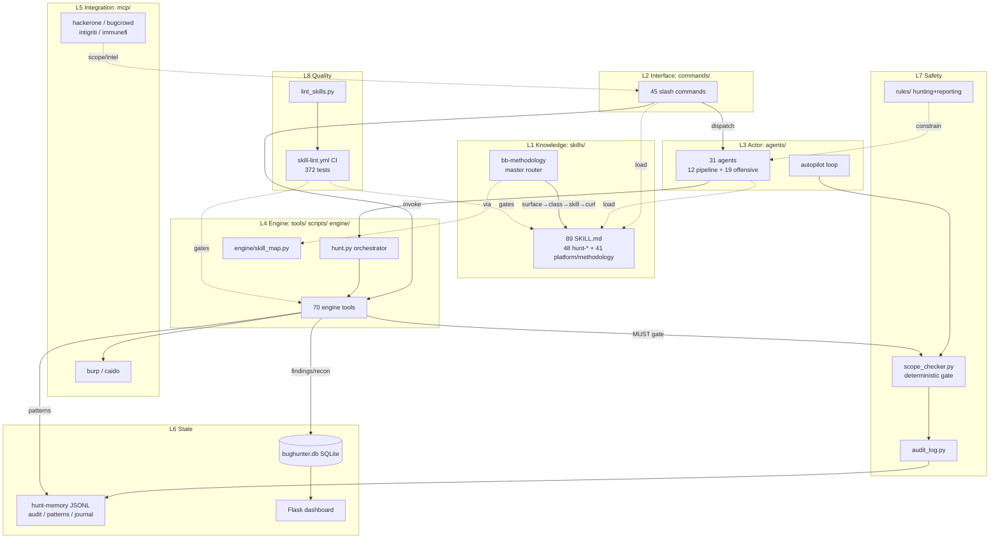
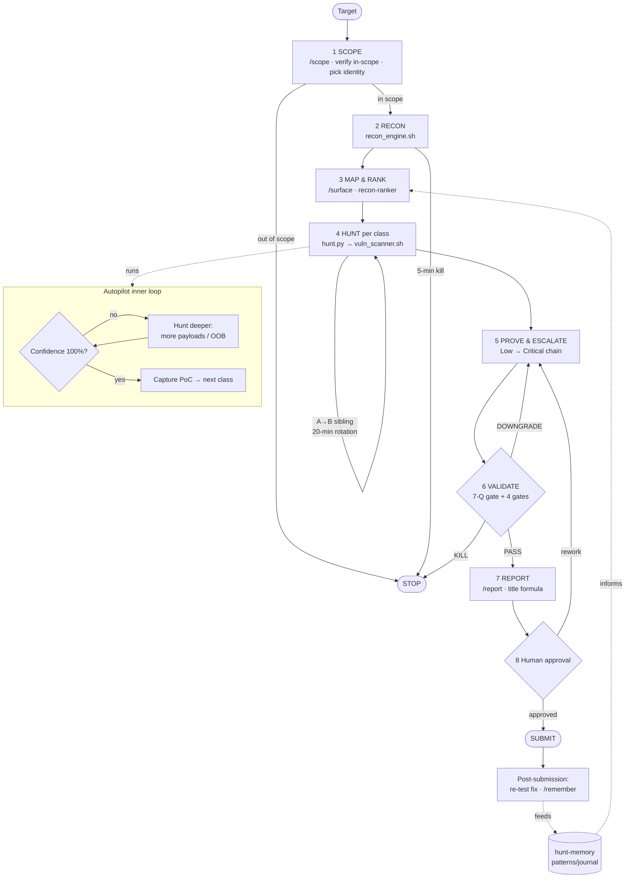

# UnifiedBugHunter

> A Claude Code plugin that turns an LLM session into a disciplined, scope-safe, memory-backed bug-bounty and red-team operator.

**At a glance:** `unified-bug-hunter` v4.3.2 · MIT · author `bpnrockstar` · **89 skills** · **45 commands** · **31 agents** · **70 engine tools** · **6 MCP servers** · **372 tests** · Flask + SQLite dashboard

---

## What it is

UnifiedBugHunter is a Claude Code *plugin* that orchestrates real offensive tooling with judgment and safety — it does **not** replace the underlying tools. Instead of running `subfinder`, `httpx`, `nuclei`, `dalfox`, `sqlmap`, `TREVORspray`, `Foundry`, etc. by hand, it wraps them in a deterministic scope checker, an append-only audit trail, cross-target pattern learning, a Flask/SQLite dashboard, and a hardened linter + CI suite. It ships **89 methodology skills, 45 slash commands, 31 subagents, 70 deterministic engine tools, and 6 MCP servers** — all governed so the operator gets cumulatively better and stays inside the rules.

---

## Why it's different

- **Methodology distilled from real disclosed material, not generic checklists.** Each `hunt-*` skill carries a `report_count` and `sources:` list in frontmatter (e.g. `hunt-idor`: 26 reports; `hunt-sqli`: 12 reports) and anchors to concrete current CVEs/advisories (Rocket.Chat CVE-2021-22911, Mongoose CVE-2024-53900, Django CVE-2024-42005; vCenter CVE-2021-21972 → 2024-37085; LLM arXiv:2412.03556 Best-of-N).
- **False-positive discipline is built in.** Every quality skill leads with a kill gate; the global **7-Question Gate** + 4-gate validator + never-submit list protect submission-validity ratio — the metric manual hunters most often torch.
- **Crown-jewel targeting + the 5-minute / 20-minute rotation rules** steer effort to where each vuln class actually pays, and abandon dead ends fast.
- **Deterministic, code-not-LLM scope safety on every outbound request** (anchored-suffix matching, fail-closed, IP/CIDR refused) — a guarantee ad-hoc tooling cannot offer.
- **Cross-target learning.** A technique that paid off on one React/Next.js target surfaces automatically on the next one (partial tech-stack overlap matching), so the operator gets *cumulatively* better.
- **Autonomous closed-loop autopilot** that runs scope → recon → rank → hunt → validate → report with circuit breakers, rate limits, and safe-method gating — behind a hard human-approval boundary before submission and before any live credential attack.

---

## Architecture

UnifiedBugHunter is an **eight-layer stack**; a request flows top-to-bottom through it, each layer with a single responsibility.

| # | Layer | Directory / key files | Responsibility |
|---|-------|------------------------|----------------|
| 1 | **Knowledge** (declarative) | `skills/` (89 `SKILL.md` dirs) | *How to think / what to check.* Pure methodology, no side effects. Auto-load by topic. `bb-methodology` is the master router. |
| 2 | **Interface** | `commands/` (45 `.md`) | Slash-command entry points. Thin routers — invoke an engine script or dispatch to an agent/skill. Prefixed to avoid collisions (`/pickup` not `/resume`). |
| 3 | **Actor** | `agents/` (31 `.md`) | Stateful subagents that run multi-step loops, pick tools, and carry safety rails in their prompts. Pinned models (Haiku/Sonnet/Opus). |
| 4 | **Engine** (deterministic) | `tools/`, `scripts/`, `engine/` | Side-effecting execution. `tools/hunt.py` orchestrator; `engine/skill_map.py` maps surface→class→skill→first curl. |
| 5 | **Integration** | `mcp/` (6 servers) | Proxy bridges (Burp/Caido) + read-only platform intel (H1/Bugcrowd/Intigriti/Immunefi). |
| 6 | **State** | `memory/` (JSONL), `dashboard/data/bughunter.db` (SQLite), `dashboard/app.py` (Flask) | Persistence: hunt-memory + findings DB + read-mostly web GUI. |
| 7 | **Safety** | `tools/scope_checker.py`, `memory/audit_log.py`, `rules/` | Deterministic scope gate, accountability audit trail, always-active behavioral rules. |
| 8 | **Quality** | `scripts/lint_skills.py`, `.github/workflows/skill-lint.yml`, `tests/`, `eval/` | Pre-merge lint + 372-test CI + accuracy eval harness. |



---

## Feature inventory

### Skills — 89 (48 `hunt-*` + 41 platform/methodology)

The legacy `find-*` family has been deleted. Families:

- **`hunt-*` per-vuln-class (48):** core web (`hunt-sqli`, `hunt-idor`, `hunt-xss`, `hunt-ssrf`, `hunt-ssti`, `hunt-xxe`, `hunt-rce`, `hunt-lfi`, `hunt-cors`, `hunt-csrf`, `hunt-oauth`, `hunt-saml`, `hunt-auth-bypass`, `hunt-mfa-bypass`, `hunt-ato`, `hunt-session`, `hunt-business-logic`, `hunt-race-condition`, `hunt-deserialization`, …), framework/stack variants (`hunt-nextjs`, `hunt-nodejs`, `hunt-laravel`, `hunt-springboot`, `hunt-aspnet`, `hunt-sharepoint`), cloud/infra (`hunt-cloud-misconfig`, `hunt-k8s`, `hunt-cicd`, `hunt-ntlm-info`), catch-alls (`hunt-misc`, `hunt-dispatch` — the target-fingerprinting loader for `/hunt`).
- **Recon / OSINT (6):** `web2-recon`, `offensive-osint`, `osint-methodology`, `supply-chain-attack-recon`, `vuln-catcher`, `bb-local-toolkit`.
- **Cloud & Enterprise Identity (6):** `cloud-iam-deep`, `m365-entra-attack`, `okta-attack`, `enterprise-vpn-attack`, `vmware-vcenter-attack`, `container-security`.
- **Reporting & Triage (6):** `triage-validation`, `report-writing`, `bugcrowd-reporting`, `redteam-report-template`, `evidence-hygiene`, `knowledge-base`.
- **Offensive specialty (10):** `malware-analysis`, `forensics`, `reverse-engineering`, `active-directory`, `mobile-pentest`, `apk-redteam-pipeline`, `social-engineering`, `credential-attack`, `code-review`, `code-patch`.
- **Web3 & Token (2):** `web3-audit`, `meme-coin-audit`.
- **LLM red-team (2):** `hunt-llm-ai`, `llm-redteam`.
- **Orchestration / methodology / mindset (10):** `bug-bounty`, `auto-hunt`, `bb-methodology`, `redteam-mindset`, `mid-engagement-ir-detection`, `security-arsenal`, `web2-vuln-classes`, `cicd-security`, `graphql-audit`, `dast-scanner`.

### Commands — 45 (7 model-driven, no backing script)

- **Recon:** `/recon`, `/cloud-recon`, `/osint-employees`, `/arsenal`.
- **Scope:** `/scope`, `/scope-aggregate`, `/surface`.
- **Hunting / Code audit:** `/hunt`, `/autopilot`, `/dast-scan`, `/scan-cves`, `/sast` (Semgrep SAST → normalized findings, regex fallback), `/sca` (lockfile SCA via osv-scanner/pip-audit → CVE advisories), `/code-audit` (runs `sast_runner`/`sca_audit` first, then the model triages), `/pr-review` (diff-scoped PR review: NEW vs pre-existing findings + secret scan on added lines + inline comments), `/js-analyze` (recover pre-minified source from a live JS bundle via source map, then SAST + secret-regex), `/dom-verify` (auto-confirm a [POSSIBLE] DOM-XSS in headless Chromium), `/graphql-audit`, `/secrets-hunt`, `/chain`.
- **Validation / Reporting / Retest:** `/triage`, `/validate`, `/report`, `/patch`, `/retest` (PoC-replay → FIXED/STILL-VULN/REGRESSED).
- **Credential pipeline:** `/wordlist-gen`, `/breach-check`, `/spray`.
- **Cloud / Takeover / Params:** `/takeover`, `/bypass-403`, `/param-discover`.
- **Web3 / Token:** `/web3-audit`, `/token-scan`.
- **LLM:** `/llm-redteam`, `/llm-config` (multi-provider router).
- **Skill routing / grounding:** `/auto-skills` (topic→skill), `/evolve-skills` (ground from disclosed reports), `/kev-matrix` (CISA-KEV coverage).
- **Monitoring / Dashboard:** `/vuln-catcher`, `/dashboard`, `/search-findings`.
- **Memory / Intel:** `/intel`, `/pickup`, `/remember`, `/memory-gc`.

### Agents — 31 (12 pipeline + 19 offensive)

All on `claude-sonnet-4-6` except: recon/monitor agents on Haiku (`recon-agent`, `recon-ranker`, `vuln-catcher`); `report-writer` on Opus.

- **Bug-bounty pipeline (12):** `recon-agent`, `recon-ranker`, `chain-builder`, `validator`, `report-writer`, `autopilot`, `web3-auditor`, `token-auditor`, `credential-hunter`, `regression-retest-agent` (drives `/retest` across a finding batch), `triage-dedup-agent` (clusters/dedups large finding sets, flags dups vs submitted), `diff-aware-pr-reviewer` (diff-scoped PR/MR reviewer — reviews only the lines a PR changed, partitions NEW vs pre-existing, posts inline comments; read-only).
- **Offensive security (19):** `binary-exploit`, `crypto-analyst`, `forensics-analyst`, `malware-analyst`, `reverse-engineer`, `social-engineer`, `container-escape`, `api-security`, `privesc-advisor`, `payload-crafter`, `attack-planner`, `ad-attacker`, `swarm-orchestrator`, `poc-validator`, `exploit-guide`, `code-reviewer`, `code-patcher`, `vuln-catcher`, `llm-redteamer`.

The pipeline is a sequential funnel (recon-agent → recon-ranker → hunt → optional chain-builder → validator + poc-validator → report-writer), with `autopilot` driving it single-threaded and `swarm-orchestrator` fanning specialists out concurrently. The critical human-in-the-loop boundary is `credential-hunter`'s **hard stop before `/spray`**.

### Engine tools — 70 (in `tools/`)

Python on `python3`, shell on Bash. Orchestrator `hunt.py`; recon `recon_engine.sh`; scanning `vuln_scanner.sh`, `cve_scan.sh`, `dast_scanner.sh`, `graphql_audit.sh`; white-box SAST `sast_runner.py` (Semgrep-backed, regex fallback) and lockfile SCA `sca_audit.py` (osv-scanner/pip-audit/govulncheck), both backing `/code-audit`'s engine pass; validation `validate.py`; regression `retest.py` (PoC-replay → FIXED/STILL-VULN/REGRESSED); dedup `dedup_findings.py`; intel `intel_engine.py`, `learn.py`; scope `scope_checker.py`, `scope_aggregator.sh`; discovery/bypass `secrets_hunter.sh`, `takeover_scanner.sh`, `cloud_recon.sh`, `param_discovery.sh`, `bypass_403.sh`; dual-account harness `dual_session.py`; CI/CD `cicd_scanner.sh`; web3 `token_scanner.py`; LLM `llm_redteam.py` (+ `llm_payloads/` library, 7 JSON files), multi-provider router `llm_router.py`; skill routing/grounding `skill_router.py`, `disclosure_miner.py`, `kev_matrix.py`; diff-scoped PR review `pr_diff_review.py` (backs `/pr-review` + the `diff-aware-pr-reviewer` agent); JS source-map recovery `sourcemap_analyzer.py` (backs `/js-analyze`); Playwright DOM-XSS confirmation `dom_xss_verifier.py` (backs `/dom-verify`); cross-engine secret reconciliation/validation `secret_validate.py` with org-specific regexes `custom_secret_patterns.py`; evidence hygiene `redact.py`; registry `external_arsenal.sh`; credential pipeline `wordlist_engine.sh`, `osint_employees.sh`, `breach_checker.py`, `spray_orchestrator.sh`. Credential gating: `wordlist_engine.sh`, `osint_employees.sh`, and `spray_orchestrator.sh` (TREVOR o365/okta modes) require `--with-credential-attack`.

### MCP servers — 6

- **Proxy bridges (live, your own traffic):** `burp-mcp-client/` (SSE↔stdio via `mcp-proxy-all.jar` to Burp `:9876`; history, filter, replay, Collaborator OOB, Scanner findings); `caido-mcp-client/` (PAT/OAuth; **parallel batch sends up to 50**; auto-redacts `Authorization`/`Cookie`/`Set-Cookie`/API-key headers).
- **Public-API intel (read-only, no auth):** `hackerone-mcp/` (disclosed reports, program stats, policy); `bugcrowd-mcp/` (Crowdstream, program info, public bounties); `intigriti-mcp/` (research/challenge/blog scrape); `immunefi-mcp/` (disclosed reports, program info incl. in-scope contract addresses + TVL, active bounties).

All degrade gracefully to curl + Interactsh/webhook.site if no MCP is connected.

---

## End-to-end workflow

A 5-phase, non-linear methodology mapped to commands:

1. **SCOPE** (`/scope`) — Define/Select/Execute discipline; decide identity (anon vs authenticated); verify each asset in scope; pick Wide vs Deep route.
2. **RECON** (`/recon` → `recon_engine.sh`) — subdomain enum → httpx + tech detect → nmap → gau/wayback/katana URLs → JS endpoint/secret grep → ffuf → config-exposure → CI/CD scan → nuclei → takeover leads. 5-min kill on all-403 / static-only / no API params / 0 nuclei.
3. **MAP & RANK** (`/surface`) — understand the app like its developer; classify and rank surface (`api.txt`, `auth.txt`, `admin.txt`, `idor-candidates.txt`); favor less-saturated classes.
4. **HUNT** (`/hunt` → `hunt.py`→`vuln_scanner.sh`) — scripted scan first, then manual deep-dive by class; error-based → time-based → OOB → boolean; A→B sibling hunting; 20-min rotation with hard stops.
5. **PROVE & ESCALATE** — turn Low into Critical (XSS→ATO, IDOR→PII scrape/ATO, SSRF→metadata→RCE, SQLi→shell); minimize prerequisites; quantify $ impact.
6. **VALIDATE** (`/validate`) — 7-Question Gate (one NO = kill) + cross-identity proof for auth bugs + 4 gates (sanity → impact → dedup → report quality). Output: PASS / KILL / DOWNGRADE.
7. **REPORT** (`/report`, only after PASS) — fixed title formula, impact-first, working PoC, CVSS 3.1 matching real impact, < 600 words, platform-specific format.
8. **SUBMIT (human-approved) + post-submission** — never auto-submitted; final pre-submit checklist; re-test deployed fixes for incomplete-patch bypass; log outcome with `/remember`.



**Autopilot closed loop** (`/autopilot`): the same scripts/outputs as the manual chain, driven by one agent loop, with an inner verification loop that rates confidence 0–100% after every hunt action and hunts deeper until each class is proven-with-PoC or ruled out. Four modes: `--paranoid` (default, stops on every finding/signal), `--normal` (after validation batch), `--yolo` (after surface exhausted; still requires report + write-method approval), `--quick` (~40% fewer tokens).

---

## Safety & memory

- **Deterministic scope checker** (`scope_checker.py`) — code-not-LLM, **fail-closed**, anchored-suffix matching (`*.target.com` matches `sub.target.com`, rejects `target.com` itself and `evil-target.com`); exclusions checked before allowlist; **IP/CIDR explicitly unsupported**. Contract: call `is_in_scope()` before *any* outbound request.
- **Audit log** (`audit_log.py`) — append-only JSONL of every outbound request; records only a **non-secret 12-char session hash** (raw cookies/tokens never written).
- **Guard primitives** — `CircuitBreaker` (threshold 5, 60s cooldown), `RateLimiter` (recon 10/s, test 1/s), `SafeMethodPolicy` (`GET/HEAD/OPTIONS` safe; others → require_approval). `AutopilotGuard.check_request()` evaluates in fixed order: circuit breaker → safe-method → rate-limit.
- **JSONL hunt-memory with rotation** (`rotation.py`) — 10 MB cap, keep 3 backups, multi-process-safe; `/memory-gc` for manual inspect/rotate/purge.
- **Schema validation** (`schemas.py`) — `CURRENT_SCHEMA_VERSION = 1`; strict required fields, rejects unknown fields, closed enums, ISO-8601 timestamps; auto-stamps UTC + session hash; auto-logs end-of-session summary.
- **Cross-target pattern learning** (`pattern_db.py`) — keyed by vuln class + tech stack; **exact match on vuln_class, partial-overlap on tech stack** so a technique surfaces on the next similar target; results sorted by payout then recency.
- **Credential opt-in gate** — `/wordlist-gen`, `/osint-employees`, `/spray` (+ `credential-hunter`) require `--with-credential-attack`; agent hard-stops before live spray; `/spray` adds typed-hostname confirm + lockout warning + audit log.

---

## Quality & CI

A single workflow `.github/workflows/skill-lint.yml` runs a `changes` job (`dorny/paths-filter`) that gates two jobs:

- **Job 1 — `lint`** (Python 3.12, stdlib-only `scripts/lint_skills.py`) over `skills/`, `commands/`, `agents/`. Enforces: frontmatter integrity (opening/closing `---`, valid YAML; for skills, `name` == dir name and `^[a-z0-9-]+$`, `description` ≤ 1024 chars, body ≤ 500 lines); no leaked/duplicate keys; balanced code fences; terminal newline (warning); a SHA-256 **identifier denylist** (plaintext names never in repo); and a **real-secret scan** (AWS keys, private-key blocks, JWTs, Slack/Google/GitHub tokens) with an allowlist for example secrets.
- **Job 2 — `tests`** (Python 3.12) runs `pytest tests/ -q` — **23 pytest files / 372 test functions** — plus `bash tests/test_cicd_scanner.sh`. An `eval/` harness (PortSwigger labs, false-positive cases) measures real hunting accuracy out-of-band, including `eval/code_corpus/` — a white-box ground-truth corpus (vulnerable + safe variants) scored by `run_eval_code.py` for precision/recall/F1.

---

## At a glance

| Dimension | Value |
|-----------|-------|
| Plugin / version | `unified-bug-hunter` v4.3.2 (MIT, author `bpnrockstar`) |
| Type | Claude Code plugin (8-layer stack), marketplace owner `bpnrockstar` |
| Skills | **89** = 48 `hunt-*` per-vuln-class + 41 platform/methodology |
| Slash commands | **45** (7 model-driven, no backing script) |
| Agents | **31** = 12 bug-bounty pipeline + 19 offensive security |
| Engine tools | **70** in `tools/` (+ `llm_payloads/` library, 7 JSON files) |
| MCP servers | **6** = 2 proxy bridges (Burp, Caido) + 4 intel (H1, Bugcrowd, Intigriti, Immunefi) |
| Models in use | Sonnet 4-6 (default), Haiku 4-5 (recon/monitor), Opus 4-7 (report-writer) |
| Dashboard | Flask `app.py` at `127.0.0.1:5000` over SQLite `bughunter.db` (WAL, FK on; 7 tables, `scan_history` unused) |
| Hunt-memory | Append-only JSONL (audit/patterns/journal); 10 MB cap / 3 backups; schema v1 |
| Safety primitives | Deterministic scope checker (fail-closed, anchored, no IP/CIDR), circuit breaker (5/60s), rate limit (10 rps recon / 1 rps test), safe-method gate, audit log (session-hash only) |
| Credential gating | `--with-credential-attack` for wordlist-gen / osint-employees / spray (TREVOR); hard-stop before live spray |
| CI | 1 workflow, 2 gated jobs (lint + tests); stdlib-only linter |
| Tests | **372** functions across 23 pytest files + 1 shell test + `eval/` harness |
| Autopilot modes | `--paranoid` (default) / `--normal` / `--yolo` / `--quick` |
| Submission policy | Reports **never auto-submitted** — explicit human approval required |

---

## Getting started

```bash
chmod +x install.sh && ./install.sh
```

Quickstart command sequence:

```text
/recon     <target>   # subdomain enum → httpx → URLs → JS grep → nuclei → takeover leads
/hunt      <target>   # scripted scan first, then manual deep-dive by vuln class
/validate             # 7-Question Gate + 4 gates → PASS / KILL / DOWNGRADE
/report               # impact-first report with working PoC (only after PASS)
```

Reports are **never auto-submitted** — submission always requires explicit human approval.

> Full per-component documentation (every skill, command, agent, engine tool, MCP server, and safety primitive) lives in [`CLAUDE.md`](../CLAUDE.md).
